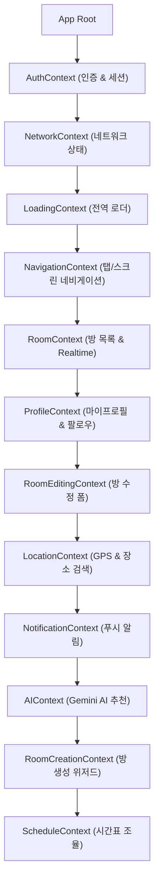
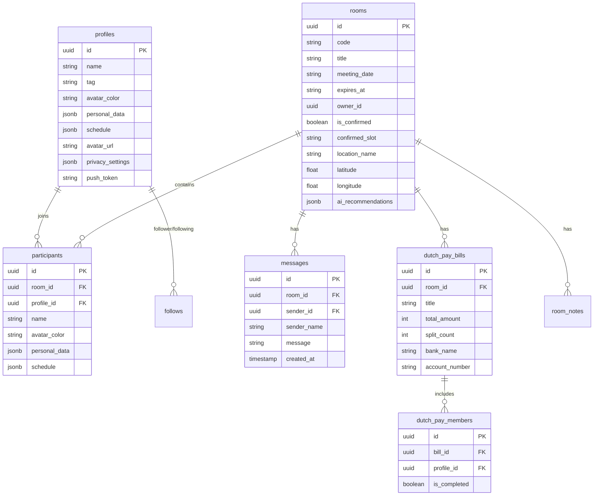

# 📱 BOBYAK (밥약) Frontend Comprehensive Functional & Structural Specification (BASEFRONT)

> **문서 목적**: 본 문서는 BOBYAK 애플리케이션의 UI/UX 및 네비게이션 구조를 전면 재설계/재구축할 때, 기존 프론트엔드에 존재하는 **모든 기능, 데이터 구조, 상태 관리, AI 통합, 외부 API 연동, 인터랙션**을 단 하나도 누락 없이 100% 보존하고 복원할 수 있도록 정리한 완전 명세서입니다.

---

## 1. 🏗️ 아키텍처 및 상태 관리 (Context Architecture)

BOBYAK 프론트엔드는 React Native (Expo) 기반으로 동작하며, 12개의 글로벌 React Context Provider를 통해 전역 상태를 모듈화하여 관리합니다.



### Context별 세부 역할 명세

| Context 명 | 주요 관리 상태 및 액션 |
| :--- | :--- |
| **`AuthContext`** | - `user`, `session`, `loading`<br>- 로그인/회원가입, 로그아웃, 비밀번호 재설정 기능 제공 |
| **`NetworkContext`** | - `isOnline`<br>- 네트워크 연결 끊김 시 오프라인 배너 표시 및 재연결 감지 |
| **`LoadingContext`** | - `isLoading`, `loadingMessage`<br>- 비동기 작업 시 전역 스피너 및 메시지 오버레이 제어 |
| **`NavigationContext`** | - `currentTab` ('rooms' \| 'friends' \| 'profile')<br>- `currentScreen` ('room_detail' \| 'create_room' \| 'auth' 등)<br>- 파라미터 전달 및 뒤로가기 스택 제어 |
| **`RoomContext`** | - `rooms` (밥약 방 목록), `currentRoomId`, `currentRoom`<br>- Supabase Realtime 구독 (방 정보 변경, 새 방 참가 자동 반영) |
| **`ProfileContext`** | - `myProfile`, `follows` (팔로우/팔로워 목록)<br>- 프로필 수정, 친구 추가/삭제(팔로우/언팔로우), 취향 정보 관리 |
| **`RoomEditingContext`** | - `editingRoomTitle`, `editingLocation`, `editingMemo`<br>- 방장 전용 방 정보 수정 폼 임시 상태 저장 및 저장/취소 |
| **`LocationContext`** | - `userLocation` (GPS 위도/경도), `locationSearchResults`<br>- 현재 위치 가져오기 및 Kakao 키워드 장소 검색 결과 관리 |
| **`NotificationContext`**| - `notifications` 목록, `unreadCount`<br>- Expo Push Token 등록, 알림 클릭 시 해당 밥약 방으로 바로 이동 |
| **`AIContext`** | - `aiRecommendations` (Gemini 분석 결과 랭킹 1~3위)<br>- AI 조율 분석 실행 중 상태 및 분석 결과 캐싱 |
| **`RoomCreationContext`**| - `creationStep` (1~4단계 위저드), `newRoomData`<br>- 방 제목, 날짜 범위, 장소, 초대 코드 생성 폼 관리 |
| **`ScheduleContext`** | - `mySchedule` (내 시간표), `roomSchedule` (참여자 통합 시간표)<br>- 셀 드래그 선택, 불참/가능 시간 토글, 개인 기본 시간표 불러오기 |

---

## 2. 📱 주요 스크린 및 UI 네비게이션 구조

### 2.1 네비게이션 맵 (Screen & Modal Navigation)

```
[ 앱 실행 / 딥링크 감지 ]
       │
       ├─► (미인증) ──► [ AuthScreen (로그인/회원가입/비번재설정) ]
       │                      │
       │                      └─► (최초 가입 시) ──► [ 온보딩 튜토리얼 (사진/위치/취향) ]
       │
       └─► (인증 완료) ──► [ 메인 3개 탭 네비게이션 ]
                               │
                               ├─► Tab 1: 밥약 목록 (RoomsTab)
                               │      ├─► [ 방 생성 위저드 (Modal / Step 1~4) ]
                               │      ├─► [ 6자리 초대코드 입력 참가가 모달 ]
                               │      └─► [ 밥약 방 상세 스크린 (RoomDetailScreen) ]
                               │             ├─► Sub-Tab 1: 일정 조율 & AI 추천 (ScheduleGrid)
                               │             ├─► Sub-Tab 2: 메뉴 추천 & 룰렛 (MenuRecommendation)
                               │             ├─► Sub-Tab 3: 더치페이 & AI 영수증 정산 (DutchPay)
                               │             └─► Sub-Tab 4: 실시간 채팅 & 이모티콘 (ChatRoom)
                               │
                               ├─► Tab 2: 친구 목록 (FriendsTab)
                               │      ├─► [ 친구 검색 및 팔로우/언팔로우 ]
                               │      ├─► [ 팔로워 / 팔로잉 리스트 ]
                               │      └─► [ 친구 프로필 상세 모달 ]
                               │
                               └─► Tab 3: 마이페이지 (ProfileTab)
                                      ├─► [ 프로필 수정 모달 ]
                                      ├─► [ 나의 식성/음식 취향 테스트 (BaeminSurvey) ]
                                      ├─► [ 고정 개인 주간 스케줄 설정 모달 ]
                                      ├─► [ 공개범위 설정 (Privacy Settings) ]
                                      └─► [ 계좌번호 / 출발지 위치 설정 ]
```

---

## 3. ⚙️ 기능별 상세 기능 명세 (Functional Specifications)

### 3.1 회원가입, 로그인 및 마이프로필

#### 1) 사용자 인증 (AuthScreen.tsx)
- **이메일/비밀번호 기반 로그인 & 회원가입**: Supabase Auth 연동.
- **비밀번호 재설정**: 이메일로 비밀번호 재설정 링크 발송.
- **자동 로그인 & 유지**: `AsyncStorage` 세션 저장.
- **기본 프로필 입력**: 가입 시 닉네임, 생년월일, 성별, 대표 계좌번호, 한줄소개(Bio) 입력.

#### 2) 음식 취향 설문 (BaeminSurvey.tsx & TastePicker.tsx)
- **5대 식성 스코어링 (0~100점)**:
  - 육류 선호도 (`meatScore`)
  - 해산물 선호도 (`seafoodScore`)
  - 매운맛 선호도 (`spicyScore`)
  - 느끼함/기름진 음식 선호도 (`greasyScore`)
  - 깔끔함/담백함 선호도 (`cleanScore`)
- **선호 음식 태그 선택**: 한식, 일식, 중식, 양식, 분식, 카페, 술집, 패스트푸드 등 다중 선택.
- **배민 스타일 UI**: 질문 카드 및 슬라이더/버튼 방식의 직관적인 취향 파악.
- **취향 뱃지 부여**: 분석 결과에 따라 프로필에 "고기 마니아", "맵부심 보유자", "깔끔파" 등의 취향 뱃지 자동 생성.

#### 3) 개인 프로필 및 친구 시스템 (ProfileSetup.tsx)
- **프로필 아바타 커스텀**: 이모지 아이콘 (`profileEmoji`) 및 아바타 배경색 (`profileBgColor`) 변경.
- **정보 공개범위 설정 (Privacy Settings)**:
  - 생년월일 (`birthdate`): 전체공개 (`public`) / 친구공개 (`best`) / 비공개 (`private`)
  - 성별 (`gender`): 전체공개 / 친구공개 / 비공개
  - 계좌번호 (`bank_account`): 전체공개 / 친구공개 / 비공개
- **고정 주간 개인 시간표 설정**:
  - 밥약에 입장할 때 자동으로 반영할 나의 기본 가능 시간(월~일 08:00~23:00)을 미리 저장.
- **친구/팔로우 관리**:
  - 닉네임/태그 기반 사용자 검색.
  - 리더 (`leader`) 및 메이트 (`mate`) 역할 구분의 팔로우/언팔로우.
  - 친구의 프로필, 아바타, 음식 취향 뱃지 조회.

---

### 3.2 밥약 방 생성 및 목록 관리

#### 1) 방 생성 위저드 (Room Creation Flow)
- **4단계 스텝 방식**:
  - **Step 1**: 방 제목 입력 (최대 50자, 유효성 검사) 및 모임 목적 선택.
  - **Step 2**: 약속 날짜 범위 선택 (오늘, 내일, 주말, CalendarModal을 통한 특정 날짜 선택) 및 가능 시간 범위 지정.
  - **Step 3**: 모임 장소 지정 (Kakao 키워드 검색 또는 지도 핀으로 위도/경도 선택).
  - **Step 4**: 방 생성 완료, 6자리 영문/숫자 고유 초대코드 (`code`) 및 딥링크 생성.

#### 2) 밥약 방 목록 (Rooms Tab / Home)
- **방 카드 UI (`RoomCard.tsx`)**:
  - 방 제목, 모임 장소, 확정된 일시, 방장 표시 (👑 아바타 배지).
  - 참여자 아바타 리스트 및 총 인원수.
  - **진행 상태 배지**:
    - `메뉴 투표 필요` (orange)
    - `일정 조율 중` (blue)
    - `약속 확정됨` (green)
    - `정산 진행 중` (purple)
- **방 목록 필터링 & 검색**:
  - 전체 / 진행 중 / 확정됨 / 완료된 밥약 탭 구분.
  - 방 제목 키워드 검색.
- **초대코드로참가**:
  - 6자리 초대코드 직접 입력 시 방 정보 조회 후 바로 참가.

#### 3) 방 설정 및 메모 (RoomEditingContext)
- **방장 전용 권한**: 방 제목 수정, 모임 장소 변경, 모임 날짜 변경, 방 삭제.
- **방 메모 (Room Notes)**:
  - 방 참여자들이 자유롭게 작성하는 꿀팁/약속 장소 가이드 메모.
  - 공개 범위: 전체 공개 / 친구 공개 / 비밀 메모.

---

### 3.3 일정 조율 & AI 추천 엔진

#### 1) 시간표 입력 및 뷰어 (`ScheduleGrid.tsx`)
- **인터랙티브 시간표 그리드**:
  - 날짜별 시간 슬롯(30분/1시간 단위) 셀 터치 및 연속 드래그를 통해 불참/가능 상태 전환.
  - "내 기본 시간표 불러오기" 버튼으로 내 개인 프로필 스케줄 원터치 입력.
- **참여자 통합 히트맵 (Heatmap View)**:
  - 셀별로 참석 가능한 인원 비율에 따라 색상 농도가 짙어짐.
  - 셀 클릭 시 해당 시간대에 **참석 가능한 인원 이름 목록**과 **불참자 목록** 팝업 표시.

#### 2) AI 최적 약속 분석 엔진 (`aiRecommender.ts`)
- **Gemini 2.0 Flash AI 분석**:
  - 참여자 전원의 가능 시간 교집합 계산.
  - 모임 장소 주변 날씨 데이터 및 평균 이동시간 계산.
  - **Top 3 최적 일시 랭킹** 산출.
  - 각 일시별 AI 한줄 추천 사유 자동 작성 (예: *"참여자 5명 전원 참석 가능하며, 강수확률 0%로 야외 모임에 최적입니다."*).
- **장소 자동 추천 (Kakao Local API 연동)**:
  - 지정된 모임 장소 좌표 주변 2km 이내의 인기 맛집/카페/술집 자동 검색 및 AI 추천 렌더링.

#### 3) 약속 확정 및 캘린더 연동
- **약속 확정 (방장 전용)**: AI 추천 항목 또는 수동 선택 항목으로 최종 모임 일시 확정 (`is_confirmed = true`).
- **디바이스 캘린더 자동 등록 (`expo-calendar`)**:
  - 확정 클릭 시 사용자 스마트폰 기본 달력(Google Calendar / iOS Calendar)에 약속 일정 등록 옵션 제공.
- **확정 푸시 알림**: 전원에게 약속 확정 푸시 알림 자동 발송.

---

### 3.4 메뉴 추천, 투표 & 룰렛

#### 1) 취향 기반 메뉴 추천 (`MenuRecommendation.tsx`)
- **참여자 취향 자동 집계**: 방에 참여한 모든 인원의 식성 스코어를 평균 내어 가장 어울리는 메뉴 카테고리 순위 산출.
- **메뉴 정보 파드**: 메뉴명, 예상 가격대, 카테고리, 추천 이유 표시.

#### 2) 메뉴 투표 및 인터랙티브 룰렛
- **메뉴 투표**:
  - 후보 메뉴 추가 기능.
  - 참여자 다중 투표 및 투표 현황 실시간 프로그레스 바 표시.
- **메뉴 결정 룰렛 원판 (Roulette Wheel)**:
  - 결정 장애 해결을 위한 회전 애니메이션 룰렛.
  - 룰렛 당첨 메뉴를 최종 밥약 메뉴로 자동 반영.

---

### 3.5 더치페이 & AI 영수증 정산

#### 1) N분의 1 정산서 생성 (`DutchPay.tsx`)
- **정산 항목 입력**: 총 금액, 정산 제목, 입금받을 은행명 및 계좌번호.
- **프로필 계좌 연동**: "내 프로필 계좌 불러오기" 버튼 지원.
- **참여자 선택**: 정산에 참여할 멤버 다중 선택 및 N분할 금액 자동 계산.

#### 2) AI 영수증 OCR 정산 (`imageOptimizer.ts` + Gemini Vision)
- **영수증 촬영/첨부**: 카메라 촬영 또는 갤러리 이미지 선택 (`expo-image-picker`).
- **이미지 자동 최적화 (`imageOptimizer.ts`)**: 해상도 및 용량 자동 축소 후 Gemini 2.0 Flash Vision 전달.
- **자동 항목 분할**: 영수증 내 메뉴별 금액 인식 및 멤버별 먹은 항목 매칭하여 정산 금액 개별 산출.

#### 3) 정산 현황 추적 및 독촉 알림
- **입금 완료 체크**: 정산 완료 시 터치하여 `is_completed` 상태 변경.
- **1-터치 계좌 복사**: 계좌번호 클릭 시 클립보드 자동 복사.
- **정산 독촉 푸시 알림**: 미입금자를 대상으로 원터치 푸시 알림 발송 (`sendUnpaidBillNotification`).

---

### 3.6 실시간 채팅 & 이모티콘

#### 1) 실시간 채팅방 (`App.tsx` Chat Tab)
- **Realtime 메시징 (Supabase Realtime)**:
  - 메시지 전송, 즉시 수신 및 자동 하단 스크롤.
  - 보낸 사람 닉네임, 아바타 색상, 전송 시각 표시.
  - 내 메시지(우측 정렬) / 타인 메시지(좌측 정렬) 구분.
- **시스템 메시지**:
  - 사용자 입장/퇴장, 약속 확정, 정산서 생성 등 주요 이벤트가 채팅창에 강조 시스템 메시지로 렌더링.

#### 2) 커스텀 밥약 이모티콘
- **이모티콘 피커 (Emoticon Picker)**:
  - 밥약 전용 8종 이상 커스텀 이모티콘 픽셀/이미지 목록.
  - `[emoticon:key]` 형식으로 채팅 데이터 저장 및 메시지 버블에서 고화질 이모티콘 이미지로 렌더링.

---

### 3.7 위치 서비스 및 카카오 지도

- **참여자 출발지 및 모임 장소 지도 표시 (`react-native-maps`)**:
  - 방 모임 장소 핀 마커 및 참여자 개별 출발 위치 마커 표시.
- **카카오 장소 키워드 검색**:
  - `https://dapi.kakao.com/v2/local/search/keyword.json` 연동.
  - 장소 검색 텍스트 입력 시 실시간 연관 장소 리스트 팝업 및 클릭 시 위치 변경.

---

### 3.8 알림 & 딥링크 (Push Notifications & Deep Linking)

#### 1) 푸시 알림 (`notificationUtils.ts`)
- **Expo Push Notifications 연동**:
  - `registerForPushNotificationsAsync()`를 통해 푸시 토큰 수집 후 Supabase `profiles` 테이블에 저장.
- **알림 시나리오**:
  - 밥약 방 초대 및 사용자 입장 알림
  - 약속 시간 최종 확정 알림
  - 새 채팅 메시지 수신 알림
  - 더치페이 미정산 내역 독촉 알림
  - **약속 1시간 전 자동 시작 리마인더 알림** (`scheduleConfirmedReminderNotification`)

#### 2) 딥링크 (Deep Linking)
- **URL 스킴**: `bobyak://join/{code}` 및 `exp://.../--/join/{code}`.
- **자동 수락 모달**: 외부 링크 클릭 시 앱이 실행되며 해당 6자리 코드의 밥약 방 참가 확인 모달이 자동으로 표시됨.

---

## 4. 🗄️ 백엔드 데이터베이스 테이블 구조 (Supabase Schema)

프론트엔드에서 참조하고 통신하는 주요 Supabase 테이블 및 필드 명세입니다.



---

## 5. 🔑 환경 변수 및 외부 서비스 통합 설정 (`ENV`)

중앙 모듈([src/constants/config.ts](file:///c:/Users/lee10/bobyak-mealchatver1/src/constants/config.ts))에서 관리하는 환경 변수 및 API 연결 명세입니다.

| 환경 변수 명 | 설명 및 활용 처 |
| :--- | :--- |
| `EXPO_PUBLIC_SUPABASE_URL` | Supabase 데이터베이스 및 Auth 연결 URL |
| `EXPO_PUBLIC_SUPABASE_ANON_KEY` | Supabase 익명 클라이언트 API 키 |
| `EXPO_PUBLIC_GEMINI_API_KEY` | Google Gemini 2.0 Flash AI 분석 및 영수증 OCR 키 |
| `EXPO_PUBLIC_KAKAO_REST_API_KEY` | Kakao Local 장소 검색 REST API 키 |

---

## 6. 🎨 전면 재설계(Rebuild) 시 준수 지침

1. **기능 100% 보존**: UI/UX Layout 및 디자인 시스템이 완전히 바뀌더라도 위 문서에 기재된 1~5절의 모든 기능과 폼, 데이터 바인딩, Realtime 연동, AI 추천 흐름은 단 하나도 생략되어서는 안 됩니다.
2. **Context 구조 유지/개선**: 전역 상태는 1절에 정의된 Context 구조에 맞춰 상태가 서로 엉키지 않도록 유지합니다.
3. **환경 변수 통제**: 모든 API 키와 외부 엔드포인트 URL은 기존대로 `src/constants/config.ts`의 `ENV` 객체를 참조합니다.
4. **유효성 검사 보존**: [src/lib/validators.ts](file:///c:/Users/lee10/bobyak-mealchatver1/src/lib/validators.ts)의 계좌번호, 금액, 생년월일(엄격한 존재 날짜 체크 포함), 닉네임, 방 제목 등의 유효성 검사 로직을 100% 적용합니다.

---
*본 문서는 BOBYAK 프론트엔드 완벽 재구축을 위한 BASEFRONT 표준 사양서입니다.*
