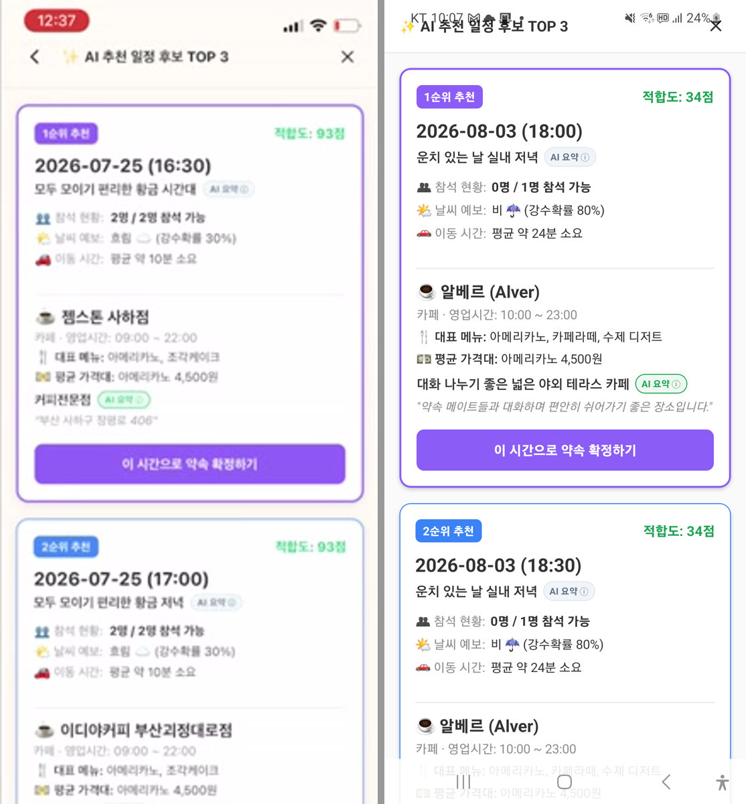
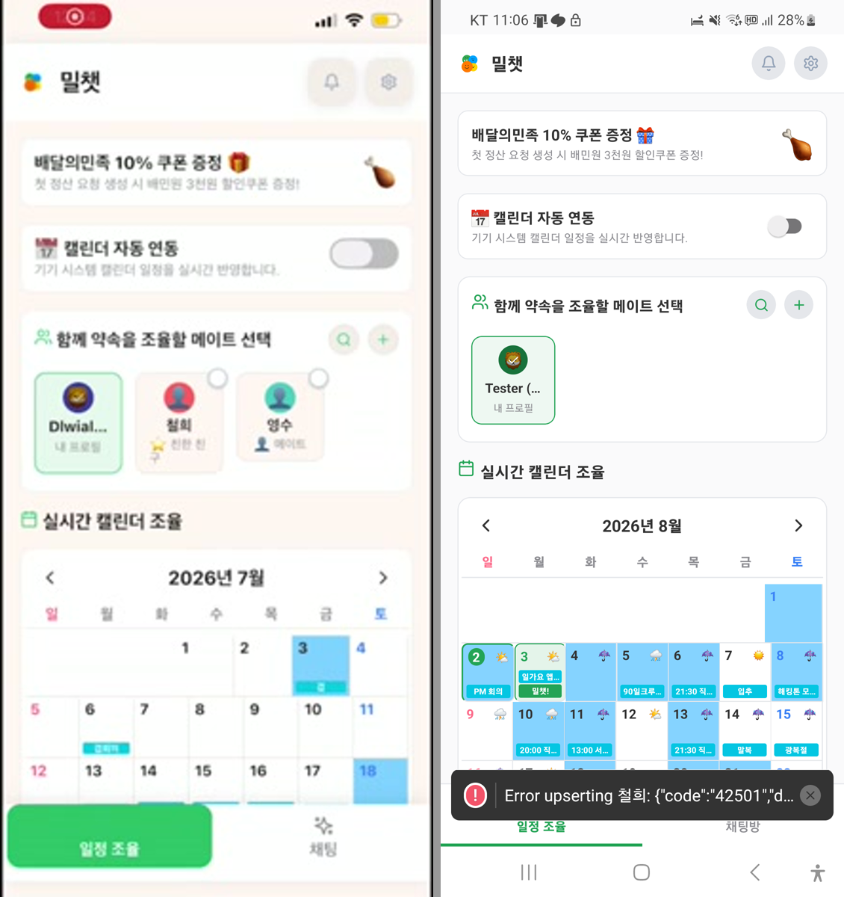
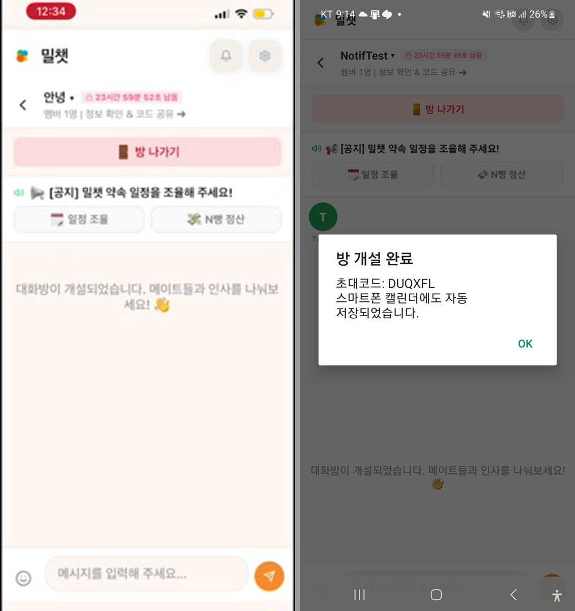
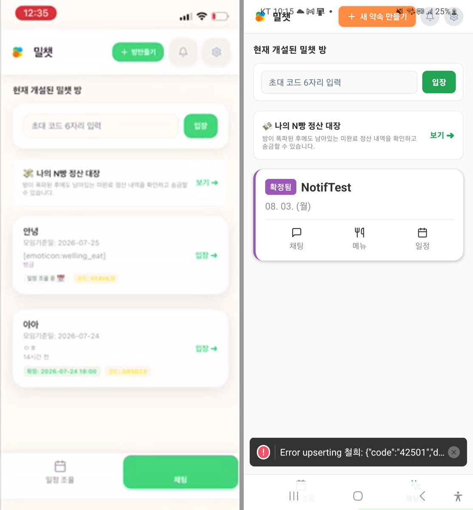
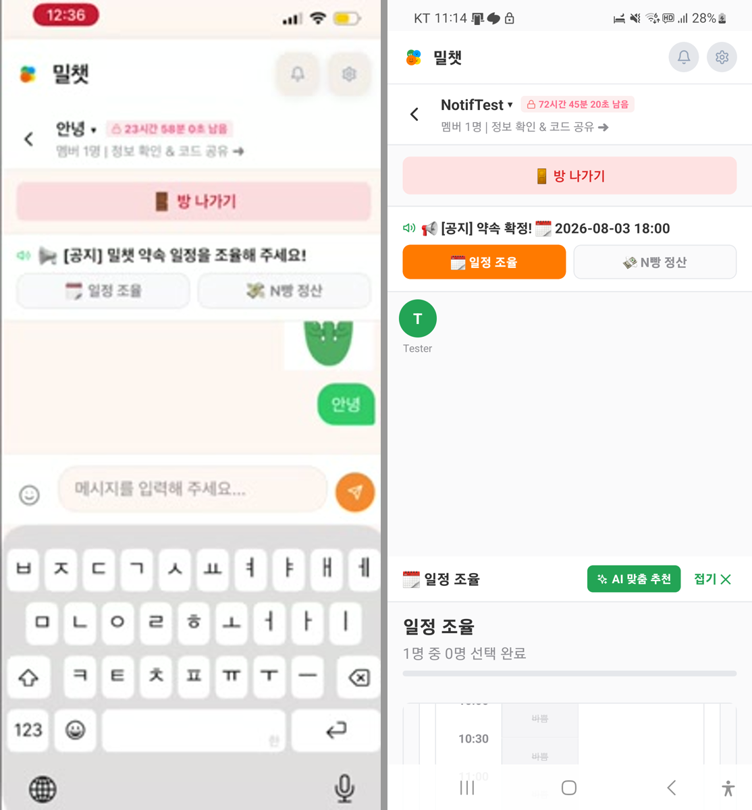
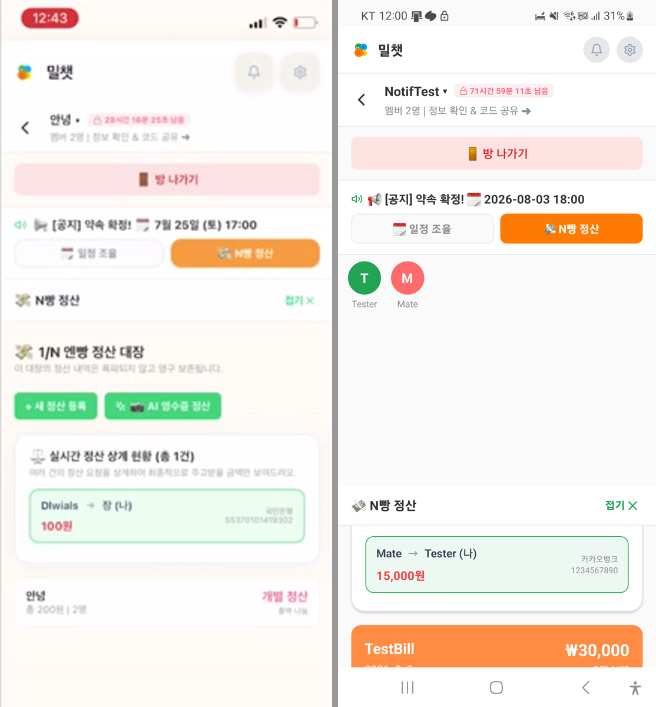
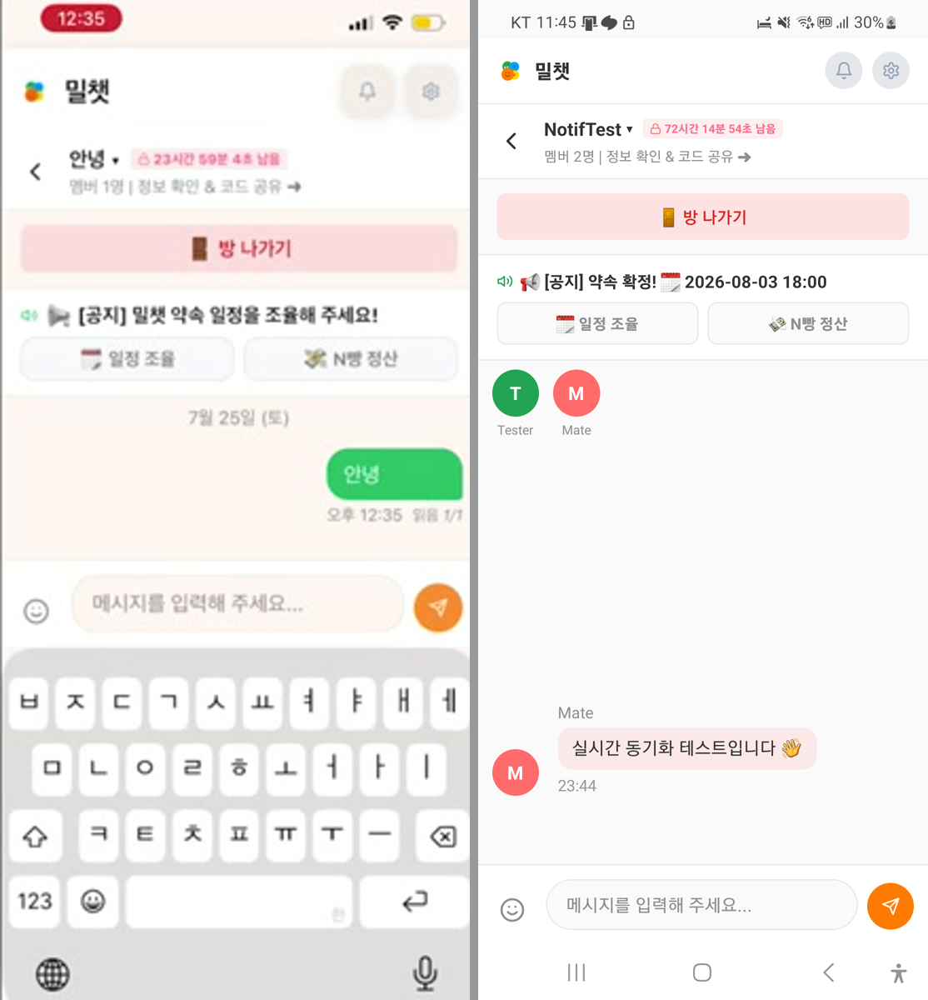
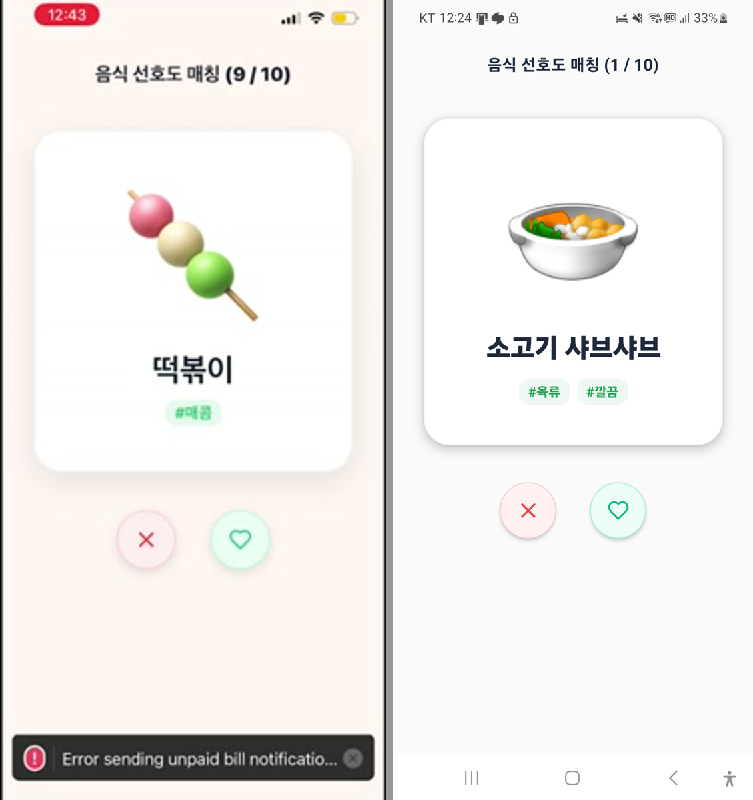
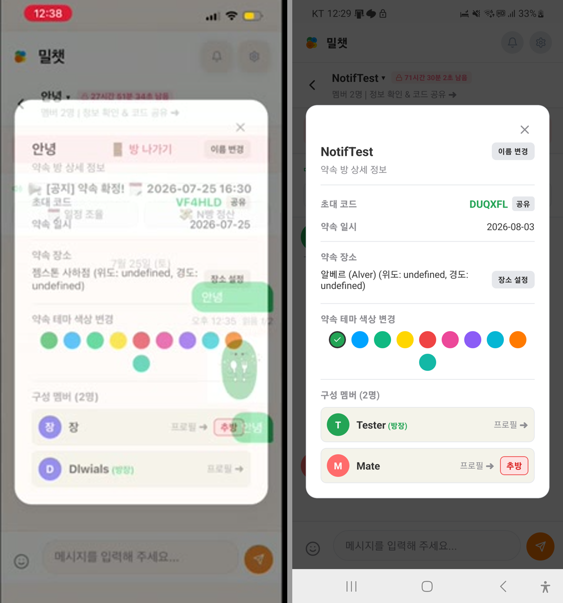
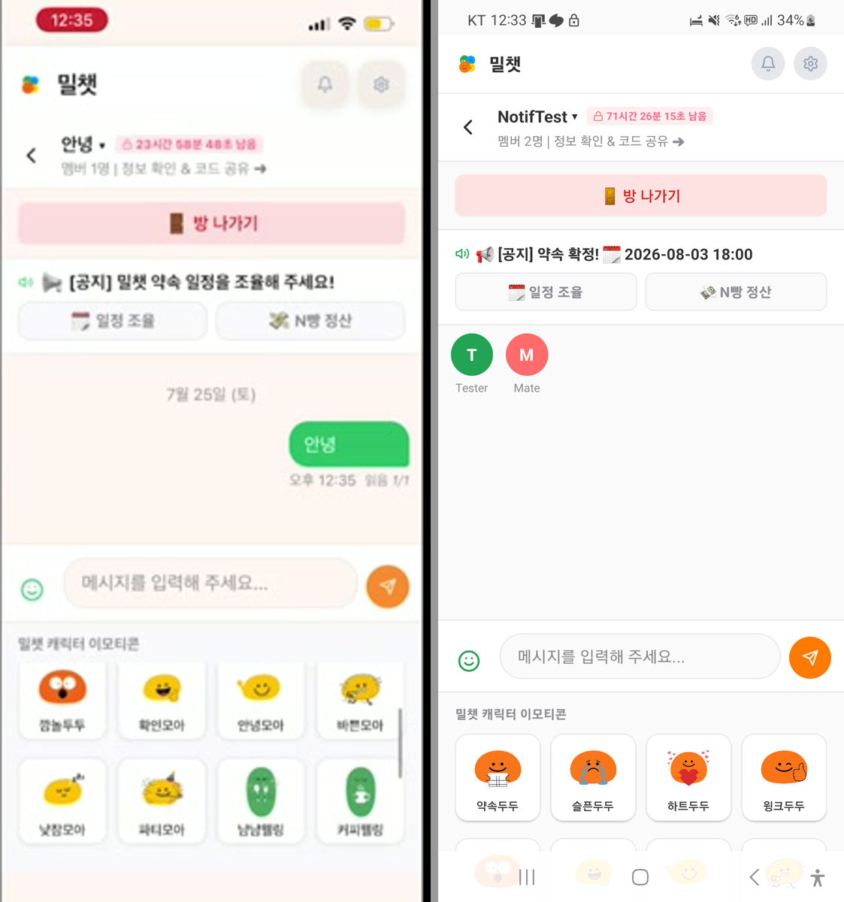

# 18. 영상 vs 실물 대조

시연 영상(iOS)과 실기기 실행 화면(Android, SM-N981N)을 같은 화면끼리 나란히 붙여 비교한 기록입니다.

- **좌측 = 영상 (iOS)** / **우측 = 실기기 (Android)**
- 영상 프레임은 `ui_video.mp4`에서 추출한 74장 중 해당 시각을 크롭
- 실기기 캡처는 `adb exec-out screencap`
- 실기기 캡처는 **오늘 수정을 모두 적용한 뒤**의 화면입니다 (SafeArea 포함)

**3회에 걸쳐 대조했습니다.**

| 차수 | 시점 | 대조 화면 |
|---|---|---|
| 1차 (A~E) | 참여자 1명, 정산 데이터 없음 | 홈 · 채팅방 · 방 목록 · AI TOP3 · 일정 조율 패널 |
| 2차 (G~I) | **2인 방 + 정산 등록 후** | 정산 상계 현황 · 채팅 메시지 |
| **3차 (K~N)** | 나머지 화면 순회 | **취향 게임 · 방 상세 모달 · 이모티콘 패널** |

2차는 1차 때 **데이터가 없어 비교 자체가 불가능**했던 화면들입니다.
현재 **12개 화면 중 11개 대조 완료**. 남은 지도 화면은 **Android 크래시로 대조 불가**입니다(N절).

## 결론

**UI 복원도는 사실상 100%입니다.** 영상의 모든 화면이 실기기에서 같은 구조로 뜨고
텍스트·색상·아이콘·간격이 일치합니다.

차이는 세 가지뿐이며 전부 원인이 규명되어 있습니다.

| # | 차이 | 원인 | 문서 |
|---|---|---|---|
| 1 | 방 목록 카드 · 정산 카드 모양 | **의도된 리디자인** (`RoomCard.tsx` 신설 / `08b55a6`) | [14](14-영상-현행코드-차이.md) |
| 2 | 메이트 0명 / 참석 0명 | **데이터 부재** — 데모 seed가 RLS에 차단됨 | [15](15-수정-내역.md) I-5 |
| 3 | 상하단 여백 | **플랫폼 차이** — iOS 전용 `SafeAreaView` (수정 완료) | [15](15-수정-내역.md) J-3 |

**계산 로직도 두 건 검증됐습니다.** 화면이 같을 뿐 아니라 숫자가 산식대로 나옵니다.

| 기능 | 영상 | 실기기 | 산식 |
|---|---|---|---|
| AI 적합도 | 93점 | 34점 | 참석률 50 + 날씨 + 이동 + 시간대 10 |
| N빵 상계 | 200원 ÷ 2 = 100원 | 30,000원 ÷ 2 = 15,000원 | `calculateSettlements()` |

### 구현률을 말할 때 구분해야 하는 것

"영상 대비 얼마나 구현됐나"는 층위에 따라 답이 달라집니다.

| 층위 | 수준 | 근거 |
|---|---|---|
| **화면 구현** | 사실상 100% | 본 문서의 대조 결과 |
| **동작하는 로직** | 상당 부분 진짜 | 일정 조율·AI 날짜 추천·캘린더 연동·방 개설·확정·정산 스키마 |
| **데이터 소스** | 상당 부분 목업 | 날씨(시드 기반 가짜)·카카오 장소(키 없으면 목업)·배민(Mock)·서버 푸시(FCM 미설정) |

즉 **"화면은 다 있고 흐름도 돈다. 다만 일부 데이터가 시뮬레이션"** 이 정확한 표현입니다.
README의 "시뮬레이션인데 실제처럼 보이는 것" 표를 함께 보세요.

---

## A. AI 추천 일정 후보 TOP 3 — 가장 결정적인 비교



카드 구조, 순위 배지 위치, 정보 행 4종, 장소 블록, 보라 확정 버튼까지
**레이아웃이 픽셀 수준으로 일치**합니다.

| 항목 | 영상 | 실기기 |
|---|---|---|
| 적합도 | **93점** | **34점** |
| 참석 현황 | 2명 / 2명 | 0명 / 1명 |
| 날씨 예보 | 흐림 ☁ (30%) | 비 ☔ (80%) |
| 이동 시간 | 약 10분 | 약 24분 |
| 장소 | 젬스톤 사하점 | 알베르 (Alver) |

**숫자 차이가 오히려 검증입니다.** [07 문서](07-AI-추천-일정-TOP3.md)에 정리한 산식대로 계산하면:

```
영상   참석 2/2 → 50점 + 날씨 흐림(80×0.2)=16 + 이동 + 저녁 10  →  93점
실기기 참석 0/1 →  0점 + 날씨 비(30×0.2)= 6 + 이동 + 저녁 10  →  34점
```

**문서화한 계산식이 실제 동작과 맞아떨어집니다.**

---

## B. 홈 (일정 조율 탭) — 구조 동일



배민 배너 → 캘린더 연동 토글 → 메이트 선택 → 실시간 캘린더 조율 순서와 스타일이 같습니다.

| 차이 | 설명 |
|---|---|
| 메이트 4명 vs 1명 | 영상은 Dlwial·철희·영수·장. 실기기는 **데모 seed가 `42501`로 차단**되어 본인만 |
| 캘린더 7월 vs 8월 | 촬영 시점 차이 |
| 탭 라벨 `채팅` vs `채팅방` | **실기기가 정답.** SafeArea 수정으로 전체 라벨이 드러남. 영상에서는 잘려 보였음 |

---

## C. 채팅방 — 완전 일치



방 헤더 · 만료 카운트다운 · `🚪 방 나가기` · 공지 바 · 서브탭 2개 · 시스템 안내 · 입력 바까지 동일합니다.

- 영상: `안녕 ▾` / `⏰ 23시간 59분 52초 남음`
- 실기기: `NotifTest ▾` / `⏰ 23시간 59분 49초 남음`

**초 단위 카운트다운 동작까지 같습니다.**

---

## D. 방 목록 — 유일하게 실질적으로 다름



| | 영상 | 실기기 |
|---|---|---|
| 헤더 버튼 | `+ 방만들기` | `+ 새 약속 만들기` |
| 상태 배지 | `일정 조율 중 🗓` / `확정: ...` | `확정됨`(보라) / `진행중`(주황) |
| 날짜 | `모임기준일: 2026-07-25` | `08. 03. (월)` |
| 최근 메시지 | 있음 (`[emoticon:welling_eat]`) | **제거됨** |
| 초대 코드 배지 | `코드: VF4HLD` | **제거됨** |
| 진입 | `입장 →` 1개 | `채팅` / `메뉴` / `일정` 3버튼 |

[14 문서](14-영상-현행코드-차이.md)에 기록한 리디자인(`RoomCard.tsx` 신설, 커밋 `e6e507d`/`31a8314`)이
실물로 확인됐습니다. `🍽 메뉴` 버튼이 [13 문서](13-미노출-화면.md)의 메뉴 화면으로 가는 유일한 경로입니다.

**복원 시 판단 필요**: 영상에 있던 최근 메시지·초대 코드가 사라졌습니다. 초대 코드 공유가
핵심 동선이라 노출 유지를 권장합니다 (14 문서 참조).

---

## E. 일정 조율 패널 — 구조 동일, 표시 영역 좁음



영상 프레임은 키보드가 올라온 채팅 상태라 패널 직접 비교는 어렵습니다.
다만 실기기에서 확인되는 사실:

- 시간 그리드(`10:30`, `바쁨` 슬롯)가 **정상 렌더**됩니다 → 그리드 회귀 수정([15](15-수정-내역.md) I-2) 유효
- 그러나 패널이 **화면 하단 25%만** 차지합니다. 영상에서는 화면 절반 이상이었습니다

원인은 오버레이가 부모 `ScrollView`의 자식이라는 구조 문제로, 근본 해결은
오버레이를 `ScrollView` 밖으로 빼는 변경이 필요해 손대지 않았습니다.

---

# 2차 대조 — 2인 방 데이터 확보 후

1차 대조 시점에는 참여자가 1명이고 정산 데이터가 없어 **비교 자체가 불가능**했던 화면들입니다.
계정 B를 만들어 2인 방을 구성한 뒤([15 문서](15-수정-내역.md) K절) 다시 대조했습니다.

## G. 정산 상계 현황 — 완전 일치 ⭐



**2차 대조에서 가장 값진 결과입니다.**

| 요소 | 영상 | 실기기 |
|---|---|---|
| 섹션 제목 | `⚖️ 실시간 정산 상계 현황 (총 1건)` | 동일 |
| 설명 문구 | `여러 건의 정산 요청을 상계하여 최종적으로 주고받을 금액만 보여드려요.` | 동일 |
| 상계 카드 | `Dlwials → 장 (나)` / `100원` / `국민은행 5537010141930` | `Mate → Tester (나)` / `15,000원` / `카카오뱅크 1234567890` |
| 카드 테두리 | 녹색 (본인 관련 건 강조) | 동일 |
| 대장 헤더 | `💸 1/N 엔빵 정산 대장` + 버튼 2개 | 동일 |

구조·문구·레이아웃·색상이 전부 같습니다. `송금자 → 수취인 (나)` 표기, 우측 은행·계좌 정렬,
금액 빨간색 강조까지 동일합니다.

**계산 로직까지 검증됐습니다.**

```
영상   : 200원   ÷ 2명 = 100원
실기기 : 30,000원 ÷ 2명 = 15,000원
```

같은 `calculateSettlements()`가 다른 입력에 대해 정확히 동작합니다.

**차이 1건** — 하단 정산 카드

| | 영상 | 실기기 |
|---|---|---|
| 형태 | 흰 카드 `안녕 / 총 200원 | 2명` + `개별 정산`/`총액 나눔` | **주황 컬러 카드** `TestBill ₩30,000` / `2명 N빵` / `정산 필요` |

[14 문서](14-영상-현행코드-차이.md)에 기록한 리디자인(`08b55a6`) 그대로입니다.
여기서 **`¥`→`₩` 수정**([15](15-수정-내역.md) B-1)이 화면에 반영된 것도 확인됩니다.

## H. 채팅 메시지 — 양쪽 스타일이 각각 확인됨



영상은 **내 메시지**, 실기기는 **상대 메시지**라 좌우가 반대입니다.
결과적으로 [04 문서](04-채팅방.md)에 기술한 두 스타일이 **각각 실물로 검증**됐습니다.

| | 스타일 | 확인처 |
|---|---|---|
| 내 메시지 | 우측 정렬 · 녹색(`primary`) 말풍선 · 흰 텍스트 · `읽음 1/1` | 영상 |
| 상대 메시지 | 좌측 아바타 + 발신자명 + 연분홍 말풍선 + 시각 | 실기기 |

**`멤버 2명` 상태도 양쪽에서 확인**됩니다 (영상 `안녕`, 실기기 `NotifTest` + 아바타 `T`·`M`).

⚠️ **차이**: 실기기에는 **날짜 구분선(`7월 25일 (토)`)이 없습니다.**
오늘 보낸 메시지라 표시되지 않은 것으로 보이나, **렌더 조건은 확인하지 않았습니다.**

## I. 2차 대조 종합

1차 결론("UI 복원도 사실상 100%")이 **데이터를 채운 뒤에도 유지**됩니다.

2차까지 영상의 12개 화면 중 **7개**를 실물과 직접 비교했습니다.
나머지는 3차(K~N)에서 이어갑니다.

---

# 3차 대조 — 남은 화면

## K. 취향 매칭 게임 ①단계 — 일치



| 요소 | 영상 | 실기기 |
|---|---|---|
| 헤더 | `음식 선호도 매칭 (9 / 10)` | `음식 선호도 매칭 (1 / 10)` |
| 카드 | 큰 이모지 + 음식명 + 태그 칩 (`떡볶이` `#매콤`) | 동일 (`소고기 샤브샤브` `#육류` `#깔끔`) |
| 버튼 | `✕`(연분홍) / `♥`(연녹색) 원형 2개 | 동일 |

카드 레이아웃·태그 칩 스타일·버튼 배치가 같고 **진행 카운터만 다릅니다**.

**부수 확인**: 영상 좌측 하단의 `Error sending unpaid bill notificatio...` 토스트가
**실기기에는 없습니다.** 알림 트리거 수정([15](15-수정-내역.md) A-1)의 효과가
무관한 화면에서도 드러납니다.

## L. 방 상세정보 모달 — 일치 + 버그 동일 재현 ⭐



초대 코드(녹색)+`공유`, 약속 일시, 약속 장소+`장소 설정`, 테마 색상 10색(9+1 줄바꿈),
구성 멤버(방장 배지 / 타인에게만 `추방`) 구조가 동일합니다.

**좌표 누락 버그가 양쪽에서 똑같이 재현됩니다.**

```
영상   : 젬스톤 사하점 (위도: undefined, 경도: undefined)
실기기 : 알베르 (Alver) (위도: undefined, 경도: undefined)
```

[README 이슈 #2](README.md)로 기록한 문제가 **영상 시점부터 지금까지 그대로**임을 확인했습니다.
`PlaceRecommendation`에 좌표 필드가 없어 `Room.latitude/longitude`가 채워지지 않습니다.

**차이 1건** — 방장 표시 순서

| | 영상 | 실기기 |
|---|---|---|
| 목록 | `장` → `Dlwials (방장)` | `Tester (방장)` → `Mate` |

방장이 아래/위로 갈립니다. `participants.created_at` 최솟값으로 방장을 판정하는 구조
([03 문서](03-방-생성-및-입장.md)의 `owner_id` 미사용 문제)와 연결됩니다.

## M. 이모티콘 패널 — 일치



`밀챗 캐릭터 이모티콘` 헤더 + 4열 그리드(이미지 + 이름) 구조가 동일합니다.

⚠️ **초판 오류 정정**: 처음에는 "목록 순서가 다르다"고 판단했으나 **틀렸습니다.**

| | 보이는 항목 |
|---|---|
| 영상 | 깜놀두두 · 확인모아 · 안녕모아 · 바쁜모아 / 낮잠모아 · 파티모아 · 냠냠웰링 · 커피웰링 |
| 실기기 (처음) | 약속두두 · 슬픈두두 · 하트두두 · 윙크두두 |
| 실기기 (스크롤 후) | 낮잠모아 · 파티모아 · 냠냠웰링 · 커피웰링 (그 아래로 더 있음) |

**영상이 스크롤된 중간 지점**을 보여준 것이고, 실기기는 목록 처음입니다.
스크롤하니 영상과 같은 항목이 같은 순서로 나옵니다.
[04 문서](04-채팅방.md)의 `nameMap` 순서(`dudu → moa → welling`)와 일치합니다.

## N. 지도 위치 지정 — 🔴 대조 불가 (Android 크래시)

진입 경로까지는 영상과 일치했습니다.

| 단계 | 영상 | 실기기 |
|---|---|---|
| `📍 좌표 지정` 버튼 | 있음 | 동일 |
| 액션시트 `출발지 좌표 지정` | `취소` / `🗺️ 지도에서 직접 지정` / `📍 현재 내 위치 (GPS)` | **동일 (3지선다)** |
| 지도 화면 | 정상 렌더 (Apple Maps) | ❌ **앱 크래시** |

```
java.lang.IllegalStateException: API key not found.
  at com.google.android.gms.maps.MapView.onCreate(...)
  at com.rnmaps.maps.MapView.<init>(MapView.java:180)
```

**Android는 Google Maps SDK를 쓰므로 API 키가 필요한데 `app.json`에 설정이 없습니다.**
영상은 iOS(Apple Maps)라 키 없이 동작했습니다.

→ **영상만 봐서는 발견할 수 없는 플랫폼 차이**이며, 실기기 대조를 시도했기에 드러났습니다.
상세와 해결 방법은 [11 문서](11-지도-위치-지정.md) 참조.

**부수 확인**: 프로필 편집의 `기본 출발 위치`에 좌표가 비어 있는데도
`위도: 37.5665 경도: 126.9780`(서울시청)이 표시됩니다 — [README 이슈 #1](README.md)의 폴백이
사용자에게 그대로 노출되는 것을 다시 확인했습니다.

---

## J. 최종 정리 (1·2·3차 통합)

### 영상과 같음 — 검증 완료

| 화면 | 확인된 것 |
|---|---|
| AI 추천 TOP 3 | 카드 전체 구조 + **적합도 산식** (93점 vs 34점이 계산과 일치) |
| **정산 상계 현황** | 섹션·문구·카드 레이아웃 + **1/N 계산** (100원 vs 15,000원) |
| **방 상세정보 모달** | 전체 구조 + **좌표 누락 버그 동일 재현** |
| 채팅방 | 헤더·카운트다운·공지·서브탭·입력바 |
| 채팅 메시지 | 내 메시지(우/녹색) · 상대 메시지(좌/아바타) **양쪽 스타일** |
| **이모티콘 패널** | 4열 그리드 + 목록·순서 (`dudu → moa → welling`) |
| **취향 게임 ①단계** | 카드·태그 칩·`✕`/`♥` 버튼 |
| 홈 | 섹션 구성과 순서 |
| 일정 조율 패널 | 내부 구조 |
| 색상 토큰 | `primary` 녹색 · `accent` 주황 · `confirmed` 보라 |

### 영상과 다름 — 원인 규명됨

| 차이 | 원인 |
|---|---|
| 방 목록 카드 | 리디자인 (`e6e507d`/`31a8314`) |
| 정산 카드 (흰색 → 주황 컬러) | 리디자인 (`08b55a6`) |
| 메이트·참석 인원 | 데모 seed가 RLS에 차단 |
| 상하단 여백 | iOS 전용 `SafeAreaView` (수정 완료) |
| 통화 기호 `¥` → `₩` | 오늘 수정 반영 |

### 대조 불가

- **지도 위치 지정** — Android에서 Google Maps API 키 미설정으로 크래시 (N절 참조).
  진입 경로(버튼·액션시트)까지는 영상과 일치 확인.

### 확인은 됐으나 조건을 규명하지 못한 것

- 채팅 **날짜 구분선**이 실기기에서 표시되지 않음 (당일 메시지라 그런 것으로 추정)
- 방장 표시 순서가 영상과 다름 (`created_at` 정렬 기준으로 추정)

### 대조 진척

| 차수 | 대조 화면 | 누적 |
|---|---|---|
| 1차 | 홈 · 채팅방 · 방 목록 · AI TOP3 · 일정 조율 패널 | 5 / 12 |
| 2차 | 정산 상계 · 채팅 메시지 | 7 / 12 |
| 3차 | 취향 게임 · 방 상세 모달 · 이모티콘 패널 | 11 / 12 |
| 3차(추가) | 지도 — **크래시로 대조 불가**, 진입 경로만 일치 확인 | **11 / 12** |
